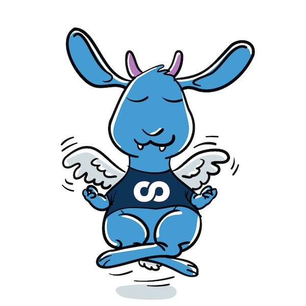

[](https://github.com/foomo/gocontemplate/actions/workflows/test.yml)
[](https://goreportcard.com/report/github.com/foomo/gocontemplate)
[](https://godoc.org/github.com/foomo/gocontemplate)

<p align="center">
  
</p>

# Go Contemplate

> A code generation helper.

Wrapper library around `golang.org/x/tools/go/packages` to filter only defined types and their dependencies.

## Example

```go
package main

import (
  "github.com/foomo/gocontemplate/pkg/contemplate"
)

func main() {
  ctpl, err := contemplate.Load(&contemplate.Config{
    Packages: []*contemplate.PackageConfig{
      {
        Path:  "github.com/foomo/sesamy-go/event",
        Types: []string{"PageView"},
      },
    },
  })
  if err != nil {
    panic(err)
  }
}
```

## How to Contribute

Please refer to the [CONTRIBUTING](.gihub/CONTRIBUTING.md) details and follow the [CODE_OF_CONDUCT](.gihub/CODE_OF_CONDUCT.md) and [SECURITY](.github/SECURITY.md) guidelines.

## License

Distributed under MIT License, please see license file within the code for more details.

_Made with ♥ [foomo](https://www.foomo.org) by [bestbytes](https://www.bestbytes.com)_
